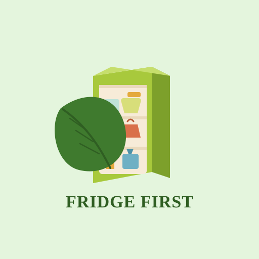
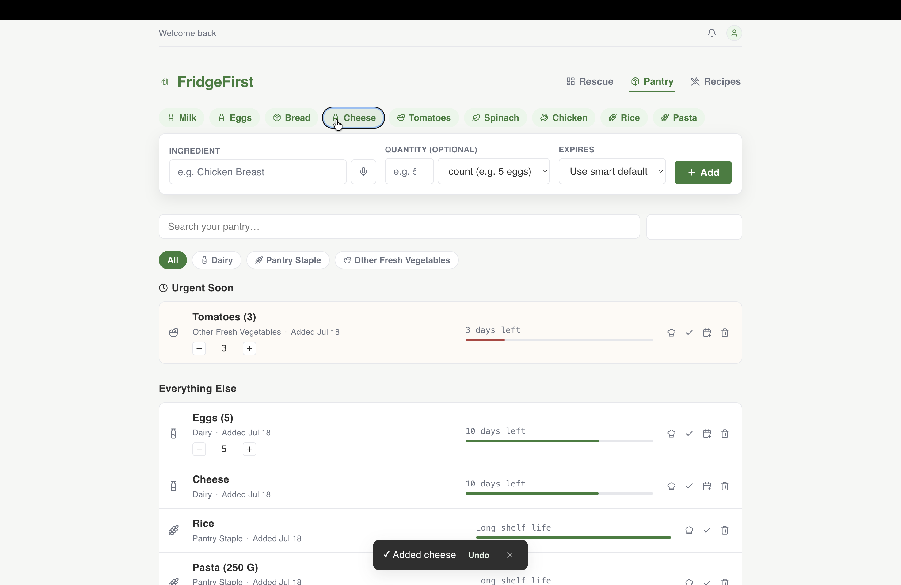
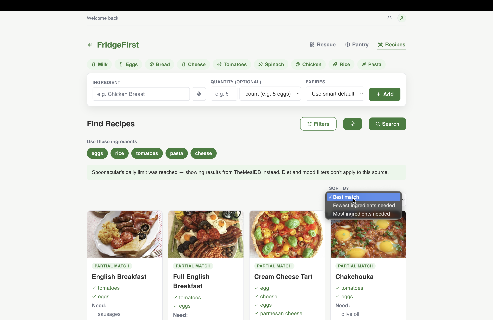
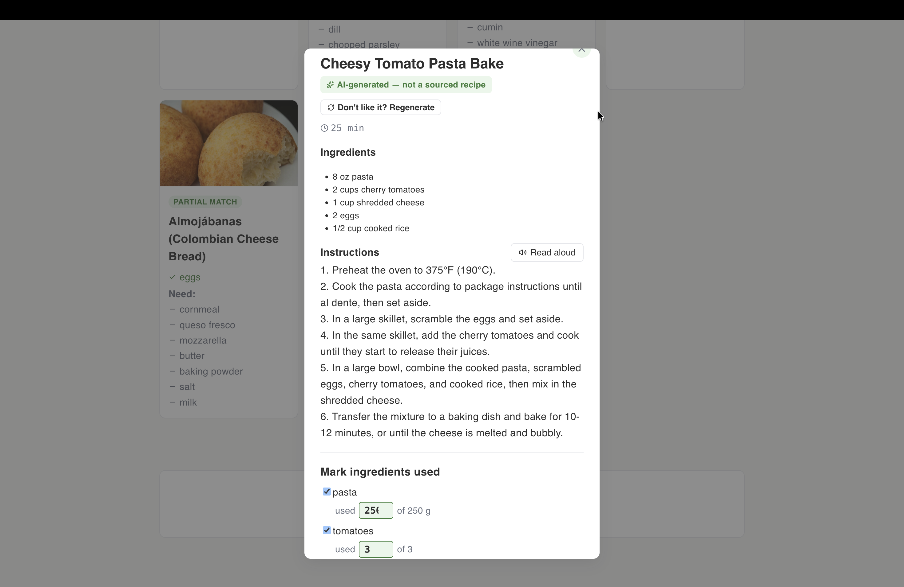
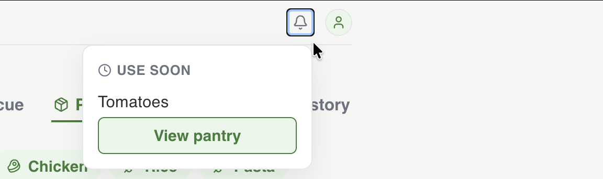
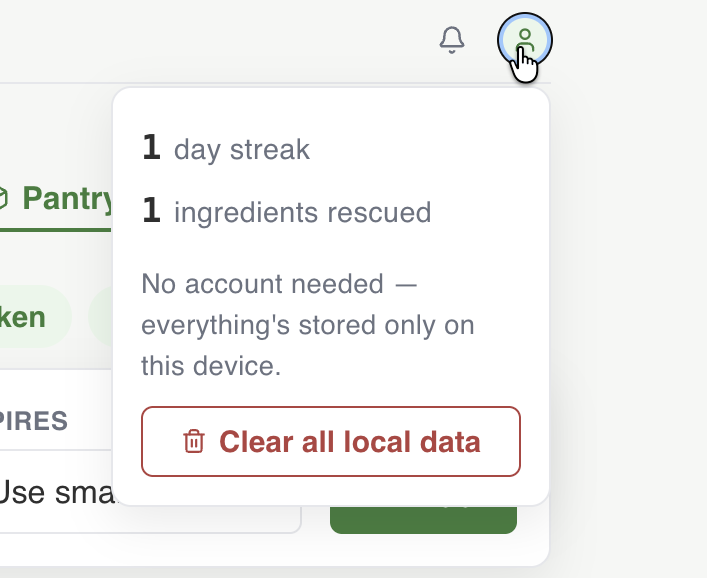

<p align="center">
  
</p>

# FridgeFirst

A desktop pantry tracker and recipe finder that helps you use up what you already have before it goes to waste. Add ingredients as you buy them, get an urgency-first view of what needs attention, and find recipes based on the ingredients already in your kitchen. No account is required, and pantry data stays on your device.

Built with React, Vite, and Electron.

## Why I built this

I built FridgeFirst to make everyday food waste easier to prevent. A lot of ingredients get thrown out not because people do not care, but because it is easy to forget what is already in the fridge, what is about to expire, or what can be cooked from the ingredients on hand.

## Screenshots

**Pantry** — urgency-grouped ingredient cards with quantity steppers you can adjust as you use things up.



**Recipe Finder** — search by ingredients on hand, with filters for meal course, mood, diet, cuisine, and cook time. If a Spoonacular request fails, FridgeFirst falls back to TheMealDB so recipe search still stays usable.



**AI recipe fallback** — when a search comes back sparse, generate a one-off recipe from your pantry, clearly labeled and regenerable if you don't like the result. "Mark ingredients used" also asks how much of a tracked quantity you actually used, instead of assuming you used it all.



**Notifications and account panel** — the bell surfaces what's expiring soon; the account panel shows your rescue stats and local-data controls (no login needed — everything's stored on-device).

<p>
  
  
</p>

## Features

- **Pantry tracking** — add ingredients with a structured form, a simple quick-add phrase like `2 eggs tomorrow`, or voice input when browser speech recognition is available. Expiry dates default from a shelf-life heuristic but can still be overridden.
- **Rescue dashboard** — an urgency-first home screen: what to eat today, what's coming up soon, and proactive recipe suggestions pulled from what's already expiring.
- **Recipe search** — real recipes from Spoonacular, filterable by ingredients on hand, meal course, mood, diet, cuisine, and cook time.
- **Recipe-service fallback** — TheMealDB powers dashboard suggestions and acts as a fallback when Spoonacular is unavailable.
- **Voice search** — speak your search instead of typing (ElevenLabs Scribe).
- **Read aloud** — have a recipe's instructions read aloud hands-free while cooking (ElevenLabs TTS).
- **AI recipe fallback** — if a search comes back sparse, generate a one-off custom recipe from your pantry ingredients (Groq / Llama 3.3). Always clearly labeled as AI-generated, never mixed in with real search results, and never a substitute for the two recipe APIs above.
- **Rescue streaks & history** — tracks how many ingredients you've used before they expired, with a simple day-streak counter.
- **Local-first storage** — pantry items, rescue history, and recent ingredient names are stored locally in `localStorage`.
- **Native notifications** — a nudge when something needs to be used today.

## Architecture

- **React + Vite renderer** — the UI in `src/` handles pantry management, recipe browsing, rescue history, and the quick-add flow.
- **Electron desktop shell** — `electron/main.js` loads the Vite app in development and the built renderer in production.
- **Local pantry storage** — the app persists pantry items, rescue history, and recent ingredient names in browser `localStorage`.
- **Recipe-service integrations** — Spoonacular is the primary recipe search API, while TheMealDB supports fallback search and proactive dashboard suggestions.
- **AI fallback flow** — Groq is only used when recipe results are sparse and the UI clearly labels the generated recipe as AI-made instead of presenting it as a sourced recipe.

## Tech stack

- React 19 + Vite (Rolldown build)
- Electron + electron-builder (packaged as a native macOS app)
- Oxlint
- Vitest
- No backend — everything is stored locally via `localStorage`

## Getting started

```bash
git clone https://github.com/vaibhaviagarwal/FridgeFirst.git
cd FridgeFirst
npm ci
```

### API keys

Create a `.env` file in the project root:

```
VITE_SPOONACULAR_API_KEY=
VITE_ELEVENLABS_API_KEY=
VITE_GROQ_API_KEY=
```

- **Spoonacular** — recipe search. Free tier at [spoonacular.com/food-api](https://spoonacular.com/food-api).
- **ElevenLabs** — voice search and read-aloud. Free tier at [elevenlabs.io](https://elevenlabs.io). You'll also need at least one voice saved to your account's voice library (Voice Library → "Add to my voices") — free-tier accounts can't use arbitrary voice IDs via the API.
- **Groq** — AI recipe fallback. Free, no card required, at [console.groq.com](https://console.groq.com).

The app degrades gracefully without any of these — Spoonacular is the only one needed for core recipe search; voice and AI generation just show a clear error if their key is missing.

### Security note on API keys

FridgeFirst is a local desktop app with no backend. That means Vite environment variables prefixed with `VITE_` are embedded into the renderer bundle and can be extracted from a packaged application. Users should provide their own API keys, and shared production credentials should not be distributed this way.

This setup is convenient for a portfolio project, but it is not a secure secret-management architecture. If FridgeFirst ever needed safely shared credentials, the next step would be a backend service or a carefully designed Electron main-process proxy instead of shipping keys to the renderer.

## Running it

```bash
npm run dev            # browser, at localhost:5173
npm run electron:dev   # desktop app in dev mode, with hot reload
```

## Testing

FridgeFirst uses Vitest for its pure logic tests.

```bash
npm test
npm run test:run
```

Current automated coverage focuses on:

- recipe matching and ranking
- pantry urgency bucketing and rescue streak logic
- quantity decrement and removal behavior
- quick-add parsing edge cases

## Building the desktop app

```bash
npm run electron:build      # packages a .dmg into release/
npm run electron:reinstall  # builds, then replaces the installed app in /Applications and relaunches it (macOS only)
```

`electron:dev` is for active development — it hot-reloads but isn't a real installed app. `electron:reinstall` is the one-command way to get changes into the actual app on your Mac.

## Project structure

```
src/
  api/           Spoonacular, TheMealDB, ElevenLabs, Groq clients
  components/    UI components
  hooks/         usePantry (core state), useRecipeSuggestions, useToast
  data/          shelf-life heuristics, ingredient suggestions, filter options
  utils/         pantry helpers, recipe ranking/matching, quick-add parsing, AI recipe generation helper
electron/
  main.js        Electron main process
scripts/
  reinstall-mac.sh
```
